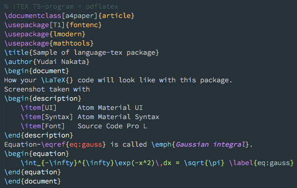

`language-tex` package
---
An Atom package that provides syntax highlight and snippets for TeX and its related stuff.



### Overview
The `language-tex` package provides your Atom with syntax highlight and code snippets for TeX, LaTeX, BibTeX and so on.
This package is a forked project of [`language-latex`](https://github.com/area/language-latex) package to fix derelict bugs and add new features.


### Install
This package has not been released via `apm` yet.
I am sorry to inconvenience you, but please clone the repository to install the package.

```bash
cd ~/.atom/packages
git clone git@github.com:yudai-nkt/language-tex.git
```

If you do not want to install manually-cloned packages in `~/.atom/packages`, you can try

```bash
export LANG_TEX_ROOT=/path/to/language-tex
git clone git@github.com:yudai-nkt/language-tex.git $LANG_TEX_ROOT
apm link $LANG_TEX_ROOT
```

### Contribution
Contributions are highly welcome. Feel free to report an [issue](https://github.com/yudai-nkt/language-tex/issues) or create a [pull request](https://github.com/yudai-nkt/language-tex/pulls).

### License
This package is distributed under the MIT License.
See [LICENSE.md](./LICENSE.md) for details.

---
Copyright (c) 2016 Yudai NAKATA
